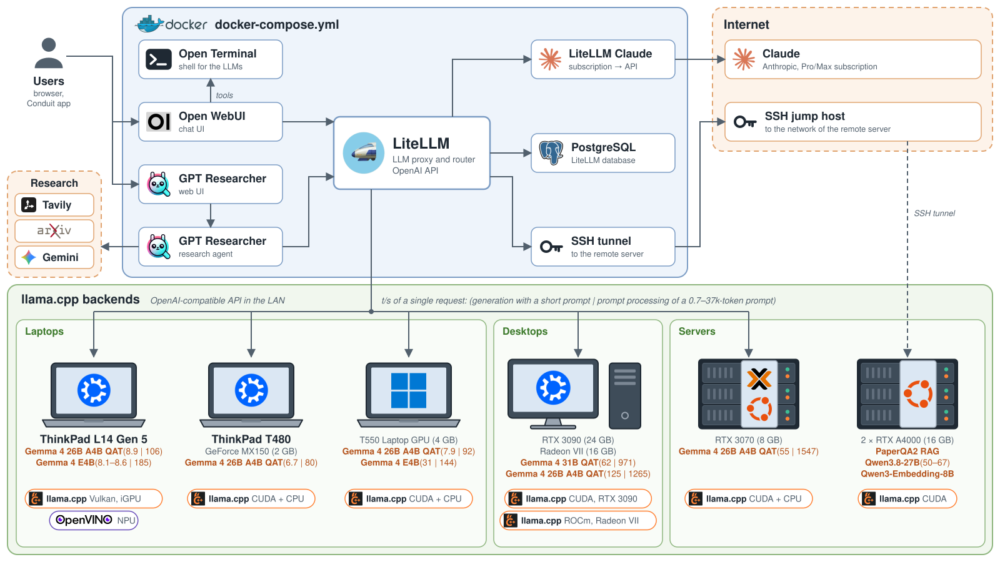

# Structure figure

[`agx-ai-structure.svg`](agx-ai-structure.svg) shows the structure of the local AI server setup of
[`../docker-compose.yml`](../docker-compose.yml) and the llama.cpp backends that LiteLLM routes requests to.



The figure is generated by [`generate.py`](generate.py) (Python 3.10+, no Python dependencies):
```sh
python3 generate.py
```
The script also renders the figure to a 3200×1800 `agx-ai-structure.png` with headless Chrome or Chromium,
which is required for the PNG output. The PNG is not committed to the repository.
The logos in [`logos/`](logos) are embedded in the SVG as data URIs, so the figure is a single self-contained 1600×900
file that also works in an `` tag, e.g. in a reveal.js slide:
```html

```
An SVG in an `` tag can use only the fonts installed on the system, so the figure uses Source Sans Pro
(the default font of reveal.js) if it is installed and Helvetica or Arial otherwise.

## Logos
The logos are from Wikimedia Commons where available. Open Terminal and OpenSSH have no logos,
so the figure uses simple terminal and key icons drawn in [`generate.py`](generate.py).
The logos are trademarks of their owners.

| File | Source | License |
|---|---|---|
| `amd.svg` | [File:AMD Logo.svg](https://commons.wikimedia.org/wiki/File:AMD_Logo.svg) | Public domain |
| `arxiv.svg` | [File:ArXiv logo 2022.svg](https://commons.wikimedia.org/wiki/File:ArXiv_logo_2022.svg) | Public domain |
| `claude-symbol.svg` | [File:Claude AI symbol.svg](https://commons.wikimedia.org/wiki/File:Claude_AI_symbol.svg) | CC0 |
| `docker.svg` | [File:Docker (container engine) logo.svg](https://commons.wikimedia.org/wiki/File:Docker_(container_engine)_logo.svg) | Apache License 2.0 |
| `gemini-icon.svg` | [File:Google Gemini icon 2025.svg](https://commons.wikimedia.org/wiki/File:Google_Gemini_icon_2025.svg) | Public domain |
| `intel.svg` | [File:Intel logo 2023.svg](https://commons.wikimedia.org/wiki/File:Intel_logo_2023.svg) | Public domain |
| `kubuntu.svg` | [File:Kubuntu 2024 Logo.svg](https://commons.wikimedia.org/wiki/File:Kubuntu_2024_Logo.svg) | CC0 |
| `nvidia.svg` | [File:NVIDIA logo.svg](https://commons.wikimedia.org/wiki/File:NVIDIA_logo.svg) | Apache License 2.0 |
| `open-webui.png` | [File:Open WebUI logo.png](https://commons.wikimedia.org/wiki/File:Open_WebUI_logo.png), trimmed and scaled to 256 px | Public domain |
| `openvino.svg` | [File:OpenVINO logo.svg](https://commons.wikimedia.org/wiki/File:OpenVINO_logo.svg) | Apache License 2.0 |
| `postgresql.svg` | [File:Postgresql elephant.svg](https://commons.wikimedia.org/wiki/File:Postgresql_elephant.svg) | BSD |
| `proxmox.svg` | [File:Logo Proxmox.svg](https://commons.wikimedia.org/wiki/File:Logo_Proxmox.svg) | Public domain |
| `ubuntu.svg` | [File:Ubuntu-logo-2022.svg](https://commons.wikimedia.org/wiki/File:Ubuntu-logo-2022.svg) | Public domain |
| `windows.svg` | [File:Windows logo - 2021.svg](https://commons.wikimedia.org/wiki/File:Windows_logo_-_2021.svg) | Public domain |
| `gptr.png` | [gpt-researcher: docs/static/img/gptr-logo.png](https://github.com/assafelovic/gpt-researcher/blob/main/docs/static/img/gptr-logo.png), trimmed, scaled to 256 px and quantized | Apache License 2.0 (repository) |
| `litellm-icon.png` | [litellm: litellm/proxy/logo.jpg](https://github.com/BerriAI/litellm/blob/main/litellm/proxy/logo.jpg), the icon cropped to a circle | See the [repository license](https://github.com/BerriAI/litellm/blob/main/LICENSE) |
| `llama-cpp.svg` | [llama.cpp: media/llama1-icon.svg](https://github.com/ggml-org/llama.cpp/blob/master/media/llama1-icon.svg) | MIT (repository) |
| `tavily.svg` | [tavily.com/logos/tavily-mark-black.svg](https://www.tavily.com/logos/tavily-mark-black.svg) | Trademark of Tavily |
